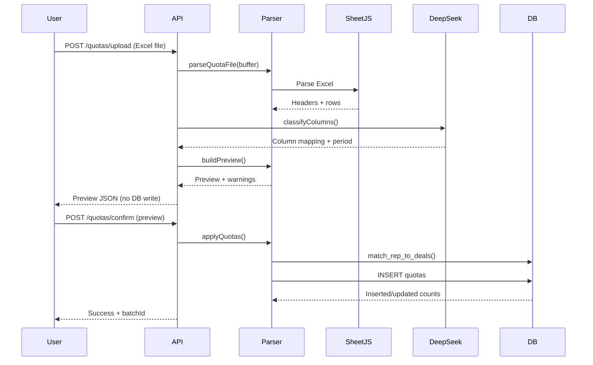

# Quota Upload Feature - Implementation Guide

**Date:** February 11, 2026
**Status:** Ready to Test

---

## Overview

The quota upload feature allows workspaces to upload Excel/CSV files with sales quotas. The system uses **DeepSeek AI** to automatically detect column mappings, then presents a preview for confirmation before writing to the database.

### Key Features

- ✅ **Excel/CSV parsing** - Supports .xlsx, .xls, and .csv files
- ✅ **AI column detection** - DeepSeek automatically identifies rep name, email, quota amount, and period
- ✅ **Smart rep matching** - Matches uploaded reps to existing deal owners by email (preferred) or name (fallback)
- ✅ **Preview before commit** - Shows what will be created with warnings
- ✅ **Batch management** - Group quotas by upload for easy undo
- ✅ **Extends existing tables** - Works with current `quota_periods` + `rep_quotas` schema

---

## Architecture

### Database Schema

**Extended existing tables** instead of creating new unified table:

```sql
-- quota_periods (already exists from migration 010)
CREATE TABLE quota_periods (
  id UUID PRIMARY KEY,
  workspace_id UUID REFERENCES workspaces(id),
  name TEXT NOT NULL,
  period_type TEXT CHECK (period_type IN ('monthly', 'quarterly', 'annual')),
  start_date DATE NOT NULL,
  end_date DATE NOT NULL,
  team_quota NUMERIC(15,2) NOT NULL,
  ...
);

-- rep_quotas (extended from migration 011)
CREATE TABLE rep_quotas (
  id UUID PRIMARY KEY,
  period_id UUID REFERENCES quota_periods(id),
  rep_name TEXT NOT NULL,
  rep_email TEXT,                    -- NEW: for better matching
  quota_amount NUMERIC(15,2) NOT NULL,
  source TEXT DEFAULT 'manual',       -- NEW: tracks origin
  upload_batch_id UUID,               -- NEW: groups uploads
  ...
);
```

**New columns:**
- `rep_email` - Preferred matching field (more reliable than name)
- `source` - Tracks where quota came from (`manual`, `excel_upload`, `csv_upload`, `hubspot`, `salesforce`)
- `upload_batch_id` - Groups quotas from same upload for batch operations

### Components

1. **`server/quotas/upload-parser.ts`** - Core logic
   - `parseQuotaFile()` - Parse Excel/CSV with SheetJS
   - `classifyColumns()` - AI column detection with DeepSeek
   - `buildPreview()` - Generate human-readable preview
   - `applyQuotas()` - Write to database with rep matching

2. **`server/routes/quotas.ts`** - API endpoints
   - `POST /api/workspaces/:id/quotas/upload` - Parse & classify
   - `POST /api/workspaces/:id/quotas/confirm` - Apply to DB
   - `GET /api/workspaces/:id/quotas` - List quotas
   - `PUT /api/workspaces/:id/quotas/:quotaId` - Edit quota
   - `DELETE /api/workspaces/:id/quotas/batch/:batchId` - Undo upload

3. **`migrations/012_rep_quotas_upload_support.sql`** - Schema changes
   - Add new columns to `rep_quotas`
   - Create indexes for email/batch lookups
   - Add helper function `match_rep_to_deals()`

---

## API Flow

### Upload Flow



### Example Upload Request

```bash
# Step 1: Upload file for preview
curl -X POST http://localhost:3000/api/workspaces/{workspaceId}/quotas/upload \
  -F "file=@Q1-2026-Quotas.xlsx"

# Response:
{
  "success": true,
  "preview": {
    "reps": [
      { "name": "Nate Phillips", "email": "nate@frontera.com", "quota": 1000000 },
      { "name": "Sara Bollman", "email": "sara@frontera.com", "quota": 800000 }
    ],
    "period": "Q1 2026",
    "periodType": "quarterly",
    "periodStart": "2026-01-01",
    "periodEnd": "2026-03-31",
    "teamTotal": 2800000,
    "repCount": 4
  },
  "warnings": [
    "2 rows skipped due to missing data"
  ],
  "uploadId": "uuid-here"
}

# Step 2: Confirm and apply
curl -X POST http://localhost:3000/api/workspaces/{workspaceId}/quotas/confirm \
  -H "Content-Type: application/json" \
  -d '{
    "uploadId": "uuid-here",
    "preview": { ... preview object from step 1 ... }
  }'

# Response:
{
  "success": true,
  "inserted": 4,
  "updated": 0,
  "skipped": 0,
  "batchId": "batch-uuid",
  "periodId": "period-uuid",
  "message": "Successfully created 4 quotas"
}
```

---

## AI Column Detection

DeepSeek analyzes the spreadsheet structure and infers:

1. **Column Mapping**
   - `rep_name` - Sales rep full name
   - `rep_email` - Email address (optional)
   - `quota_amount` - Target dollar amount
   - `period` - Time period label (optional if all rows same period)

2. **Period Detection**
   - `period_type` - monthly, quarterly, or annual
   - `period_start` / `period_end` - Date range
   - `inferred_period` - Human label ("Q1 2026", "January 2026")

3. **Format Detection**
   - `currency` - USD, EUR, etc.
   - `has_header_row` - Whether row 1 is header or data
   - `annual_needs_split` - Whether to divide annual into quarters

### Example Spreadsheet Formats

**Format 1: Quarterly with emails**
```csv
Rep Name,Email,Q1 2026 Quota
Nate Phillips,nate@frontera.com,500000
Sara Bollman,sara@frontera.com,350000
```

**Format 2: Annual without emails**
```csv
Sales Rep,FY2026 Target
John Doe,$1,200,000
Jane Smith,$900,000
```

**Format 3: Monthly by column**
```csv
Rep,Jan,Feb,Mar
Alice,100000,100000,100000
Bob,80000,80000,80000
```

---

## Rep Matching Logic

The system tries multiple matching strategies:

1. **Email match (preferred)** - Exact match on `owner_email` in deals table
2. **Name match (fallback)** - Case-insensitive match on `owner` field
3. **No match** - Still inserts quota with uploaded name/email (future deals will match)

### Match Function

```sql
SELECT * FROM match_rep_to_deals(
  'workspace-id',
  'nate@frontera.com',  -- rep_email
  'Nate Phillips'        -- rep_name
);
```

Returns:
- `matched_email` - Email found in deals
- `matched_name` - Name found in deals
- `deal_count` - Number of deals for this rep

---

## Testing

### Manual Test (Scripts)

```bash
# Run automated test
npx tsx scripts/test-quota-upload.ts
```

This will:
1. Create sample CSV with 4 reps
2. Parse and classify with AI
3. Apply to database
4. Verify insertion

### Manual Test (API)

```bash
# 1. Create test CSV
cat > test-quotas.csv << EOF
Rep Name,Email,Q1 2026 Quota
Nate Phillips,nate@frontera.com,1000000
Sara Bollman,sara@frontera.com,800000
Carter McKay,carter@frontera.com,500000
Jack McArdle,jack@frontera.com,500000
EOF

# 2. Upload for preview
curl -X POST http://localhost:3000/api/workspaces/{workspaceId}/quotas/upload \
  -F "file=@test-quotas.csv" | jq '.'

# 3. Copy uploadId and preview from response, then confirm
curl -X POST http://localhost:3000/api/workspaces/{workspaceId}/quotas/confirm \
  -H "Content-Type: application/json" \
  -d '{"uploadId": "...", "preview": {...}}' | jq '.'

# 4. Verify in database
psql $DATABASE_URL -c "
  SELECT rq.rep_name, rq.rep_email, rq.quota_amount, qp.name as period
  FROM rep_quotas rq
  JOIN quota_periods qp ON qp.id = rq.period_id
  WHERE qp.workspace_id = '{workspaceId}'
  ORDER BY rq.quota_amount DESC;
"

# 5. Run forecast-rollup to see attainment
curl -X POST http://localhost:3000/api/skills/forecast-rollup/run \
  -H "Content-Type: application/json" \
  -d '{"workspaceId": "{workspaceId}"}'
```

---

## Integration with Forecast Skill

The `checkQuotaConfig` step in forecast-rollup already reads from `rep_quotas`:

```typescript
// server/skills/tool-definitions.ts:1584
const activePeriod = await query(`
  SELECT id, name, period_type, start_date, end_date, team_quota
  FROM quota_periods
  WHERE workspace_id = $1
    AND start_date <= CURRENT_DATE
    AND end_date >= CURRENT_DATE
  LIMIT 1
`);

const repRows = await query(`
  SELECT rep_name, quota_amount
  FROM rep_quotas
  WHERE period_id = $1
`);
```

After uploading quotas, the forecast skill will automatically:
- Show team attainment vs team quota
- Show per-rep attainment percentages
- Assign rep status (crushing/on_track/at_risk/behind/off_track)
- Include gap-to-quota analysis in narrative

---

## Error Handling

### File Parsing Errors

- **Invalid file type** → 400 error with clear message
- **Corrupt file** → 500 error with "Failed to parse file"
- **Empty sheet** → 400 error "Sheet is empty"

### AI Classification Errors

- **DeepSeek fails** → 500 error with suggestion to specify columns manually
- **Low confidence** → Warnings in preview, user can override

### Rep Matching Warnings

- **No email column** → Warning: "matched by name only (less reliable)"
- **Rep not found in deals** → Still inserts, future deals will match
- **Multiple reps with same name** → Uses first match

### Quota Conflicts

- **Duplicate rep+period** → Updates existing quota (latest upload wins)
- **Invalid amounts** → Skips row, includes in warnings
- **Invalid dates** → Returns error, user must fix period

---

## Batch Operations

### Undo an Upload

```bash
# Get batch ID from confirm response
BATCH_ID="batch-uuid-here"

# Delete all quotas from this upload
curl -X DELETE http://localhost:3000/api/workspaces/{workspaceId}/quotas/batch/$BATCH_ID

# Response:
{
  "success": true,
  "deleted": 4,
  "message": "Deleted 4 quotas from batch"
}
```

### View Upload History

```sql
-- See all uploads for a workspace
SELECT
  rq.upload_batch_id,
  COUNT(*) as quota_count,
  SUM(rq.quota_amount) as total_quota,
  MIN(rq.created_at) as uploaded_at,
  qp.name as period
FROM rep_quotas rq
JOIN quota_periods qp ON qp.id = rq.period_id
WHERE qp.workspace_id = '{workspaceId}'
  AND rq.upload_batch_id IS NOT NULL
GROUP BY rq.upload_batch_id, qp.name
ORDER BY MIN(rq.created_at) DESC;
```

---

## What's NOT Included

- ❌ **UI** - API-only for now, settings page UI comes later
- ❌ **HubSpot Goals API** - Future integration
- ❌ **Salesforce Quota Objects** - Future integration
- ❌ **Recurring imports** - One-time upload only
- ❌ **Approval workflow** - Immediate apply on confirm
- ❌ **Quota versioning** - Only tracks upload batch, no history

---

## Deployment Checklist

### On Replit

```bash
# 1. Pull latest code
git pull origin main

# 2. Install dependencies
npm install

# 3. Run migration
psql $DATABASE_URL -f migrations/012_rep_quotas_upload_support.sql

# 4. Restart server
pm2 restart all

# 5. Run test
npx tsx scripts/test-quota-upload.ts

# 6. Verify API
curl http://localhost:3000/api/workspaces/{workspaceId}/quotas
```

### Success Criteria

✅ Migration runs without errors
✅ Test script completes successfully
✅ File upload returns preview JSON
✅ Confirm applies quotas to database
✅ Forecast-rollup shows attainment percentages

---

## Troubleshooting

### Issue: "DeepSeek classification failed"

**Cause:** AI couldn't parse spreadsheet structure
**Fix:** Spreadsheet format is unusual, need manual column specification (future feature)

### Issue: "No reps matched to existing deals"

**Cause:** Rep names/emails in upload don't match deals table
**Impact:** Quotas still inserted, but won't show in forecast until deals sync
**Fix:** Ensure rep names match `deals.owner` or emails match `deals.owner_email`

### Issue: "Duplicate quota for rep+period"

**Cause:** Rep already has quota for this period
**Behavior:** Updates existing quota (latest upload wins)
**Fix:** This is expected behavior, check batch history if unintended

---

**Status:** Implementation complete, ready for testing on Replit!
